# 【Construct 3】ghost-shooting-plus - Lab1 Blog 

Game URL：https://molinight.github.io/ghost-shooting-plus/

---

## 一、实验/学习工具

Construct 在线游戏编程工具： https://editor.construct.net

---

## 二、实验资料

Construct 2 初学入门教程：https://www.construct.net/en/tutorials/construct2-1808 

---

## 三、游戏设计 
1. 玩家

   该游戏为单人游戏；在游戏中，玩家将扮演一名为掩护其余干员撤离而独自留下断后的精英干员，与怪物们进行殊死搏斗；

2. 目标 

   在怪物们的进攻中存活下来，并杀死最终的怪物统领；

3. 操作 

   玩家点击“游戏开始”按钮后开始游戏； 

   玩家将使用方向键上下左右操控角色进行平面上的八方向移动，在移动鼠标调节角色朝向的同时，可点按或长按鼠标左键进行单次或持续射击； 

4. 资源 

   角色存在Lv与Score属性，Lv属性的取值与Score属性的取值相关； 
    
   角色的攻击方式、技能解锁、攻击间隔与Lv属性的取值相关；

      >存在单子弹射击，三子弹散射两种攻击方式与环绕射击一种技能； 

   本游戏无时间资源上的限制； 

   角色发射的子弹的初始速度为600，加速度为-100，在速度 <= 0后，子弹停止运动，销毁对象； 

5. 规则 

      >在游戏开始后，每隔1秒，在游戏场景边缘处随机生成一个普通怪； 
   
      >在角色Lv > 1后，每隔3秒，在游戏场景边缘处随机生成一个精英怪，精英怪的体型较大，血量较多，移动速度较慢； 
   
      >在角色Lv > 2后，每隔1.5秒，在游戏场景边缘处随机生成一个红色自爆怪，自爆怪的移动速度较快，在创建一段时间后自动爆炸死亡； 

   普通怪、精英怪与自爆怪的系统生成相互独立； 

   怪物死亡（玩家角色击杀或怪物自爆）后，角色的Score = Score + 1； 

      >在角色的Score = 10后，角色的Lv = Lv + 1 = 2，角色解锁环绕射击技能； 
      
      >在角色的Score = 20后，角色的Lv = Lv + 1 = 3，角色的攻击方式升级为散射； 
      
      >在角色的Score = 35后，角色的Lv = Lv + 1 = 4，角色环绕射击技能的冷却时间减少； 
      
      >在角色的Score = 50后，角色的Lv = Lv + 1 = 5，角色鼠标射击的攻击间隔减少； 
      
      >在角色的Score = 70后，游戏进入BOSS战阶段，中止所有怪物的自动生成，移除场上所有怪物后，在游戏场景边缘处生成一个怪物统领； 

   怪物统领的体型巨大，血量极多，移动速度较慢，拥有毒液吐息技能； 

   玩家操控的角色在与各类怪物或毒液吐息发生碰撞后死亡 ； 

6. 边界 

   游戏场景大小为1920*1080，玩家操纵的角色与怪物无法移动出场景边界； 

7. 结果 

   若玩家操控的角色死亡，则战斗失败，游戏结束； 
   若玩家操纵的角色杀死最终的怪物统领，则战斗胜利，游戏结束； 

---

## 四 、主要对象实现 
1. Background 
   
   双击画布，选择平铺图对象，载入教程内提供的背景图片； 

2. Player 

   双击画布，选择精灵对象，载入 教程 内提供的Player图片； 

   选择Player对象，为其添加8方向、边界约束与镜头跟随行为； 

   实例变量设置： 
         
      >Lv：数值型变量，默认为1，表示Player的等级； 
            
      >Score：数值型变量，默认为0，表示Player获得的分数； 
            
      >GameStart：布尔型变量，默认为False，表示游戏是否启动； 
            
      >Attackable：布尔型变量，默认为True，表示Player能否攻击，用于设置攻击间隔； 
            
      >WaitTime：数值型变量，默认为0.75，表示Player的攻击间隔； 
            
      >MultiAttack：布尔型变量，默认为False，表示Player是否解锁散射的攻击方式； 
            
      >CircleAttack：布尔型变量，默认为False，表示Player是否解锁环绕射击技能； 
            
      >CircleTime：数值型变量，默认为3，表示Player的环绕射击技能的冷却时间； 

      >Final：布尔型变量，默认为False，表示游戏是否进入BOSS战； 

3. Monster 

   双击画布，选择精灵对象，载入 教程 内提供的Monster图片； 

   选择Monster对象，为其添加子弹行为； 

   实例变量设置： 

      >Hp：数值型变量，默认为1，表示Monster的血量；

---

## 五 、主要事件表实现

### 1. Player操作 

#### （1）Player转向； 

为保证Player的朝向与鼠标的指向时刻保持一致，添加下列事件与动作；

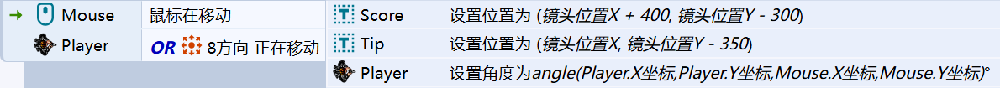

其中，Score显示Player获得的分数，Tip显示游戏的操作提示；时刻调整Score与Tip的位置，保证其显示在屏幕的右上方； 

#### （2）Player射击； 

为实现鼠标长按时Player的持续射击的效果，添加下列事件与动作； 

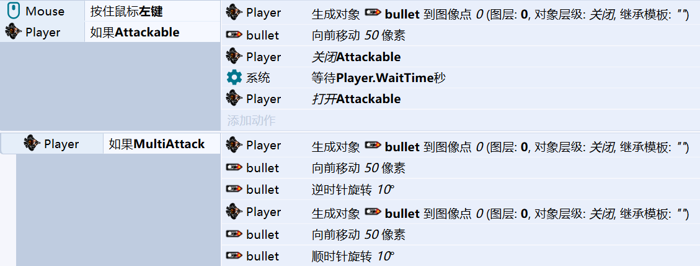

其中，bullet对象存在子弹行为，动作“bullet 向前移动50像素”用于优化视觉效果； 

正常射击的视觉效果如下； 

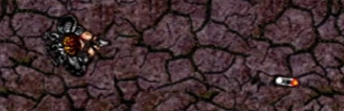

若不设置Attackable变量，则鼠标长按时Player射出的子弹将连为一条线； 

创建上述事件的子事件进行散射判断与处理； 

若Player已解锁散射的攻击方式，则额外创建两发子弹，视觉效果如下； 

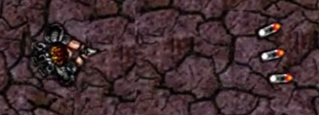

#### （3）Player技能； 

每隔CircleTime秒进行一次技能释放判断，若Player已解锁环绕射击技能，则释放技能，循环创建bullet实现； 

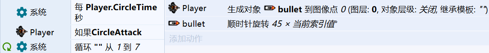

环绕射击的视觉效果如下； 

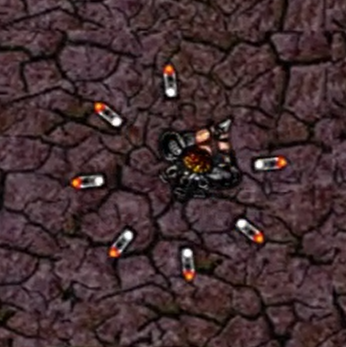

### 2. Player升级 

对Player获得的分数进行判断，根据判断结果修改Player的各实例变量； 

可简单通过修改Player升级的判断条件，与Player的各实例变量的修改顺序和修改值来更改游戏难度； 

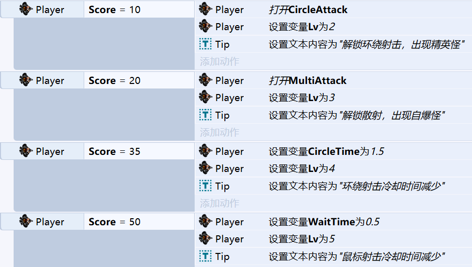

### 3. Monster 行为;

#### （1）Monster创建； 

在游戏启动后，每隔一定时间进行一次Monster创建判断； 

小怪，精英怪与自爆怪的创建判断相对独立；同时，若游戏处于BOSS战阶段，则不进行小怪，精英怪与自爆怪的创建； 

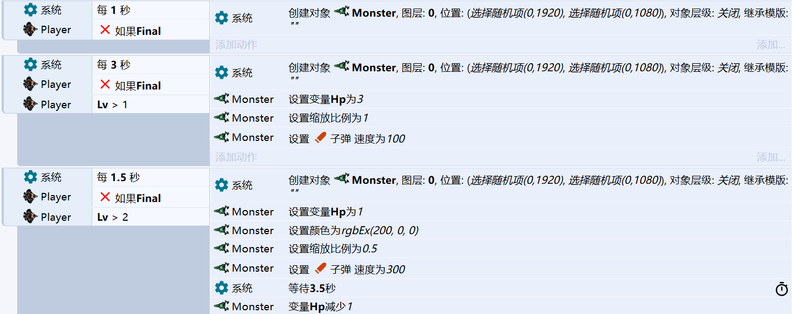

其中，精英怪的体型较大，血量较多，移动速度较慢；自爆怪的移动速度较快，创建一段时间后自动爆炸死亡； 

#### （2）Monster移动； 

为Monster对象添加子弹行为后，Monster对象可自动向前移动； 

此时只需不断调节Monster的朝向，便能实现Monster追踪Player的视觉效果； 

#### （3）Monster死亡； 

为创建的Boom对象添加滤色滤镜，消除图片黑底； 

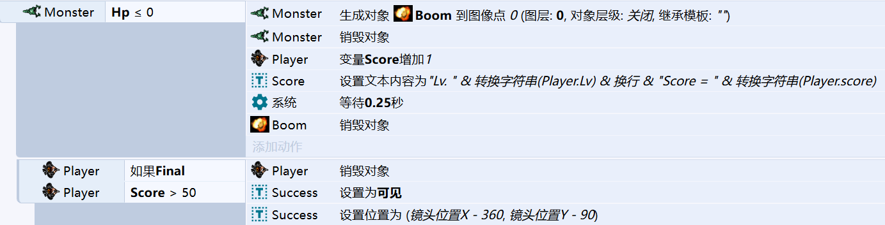

创建上述事件的子事件，判断死亡的Monster是否为BOSS； 

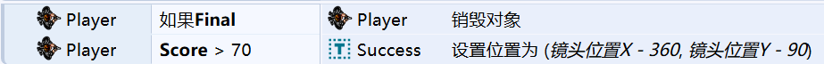

#### （4）Monster攻击； 

进入BOSS战后触发下列事件与动作，其中，BOSSAttack对象存在子弹行为； 

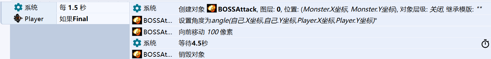

### 4. 碰撞处理 

#### （1） bullet与Monster的碰撞； 

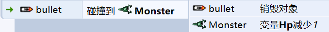

#### （2）Monster相关对象与Player的碰撞； 

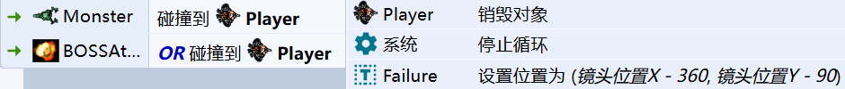

其中，BOSSAttack对象表示BOSS的毒气吐息；

### 5. 游戏阶段变化 

#### （1） 游戏启动； 

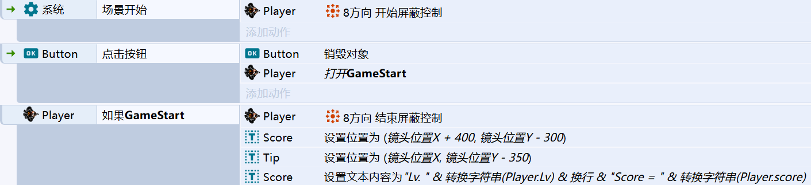

其中，Button的文本内容为“游戏开始”； 

注意，“Player操作”，“Monster创建”等游戏启动后才可能发生的事件都为“Player 如果GameStart”事件的子事件； 

#### （2）进入BOSS战； 

进入BOSS战后，销毁在场的所有Monster，并将Final设置为True，以禁用Monster的自动生成，并用于最终游戏胜利的判断； 

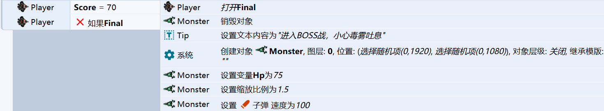
